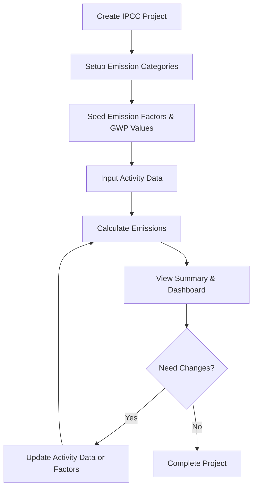

# IPCC Carbon Calculation - Frontend Implementation Guide

## 📋 Table of Contents

1. [Overview](#overview)
2. [Router Structure](#router-structure)
3. [Workflow](#workflow)
4. [Seed Data Requirements](#seed-data-requirements)
5. [Calculation Formulas](#calculation-formulas)
6. [Implementation Examples](#implementation-examples)
7. [Best Practices](#best-practices)
8. [Common Patterns](#common-patterns)

---

## 🎯 Overview

IPCC (Intergovernmental Panel on Climate Change) router menyediakan sistem perhitungan emisi gas rumah kaca berdasarkan standar IPCC. Sistem ini memungkinkan user untuk:

- Membuat dan mengelola project inventarisasi emisi
- Input data aktivitas (activity data)
- Melakukan perhitungan emisi otomatis
- Melihat summary dan dashboard compliance

### Key Concepts

- **Activity Data**: Data aktivitas yang menghasilkan emisi (contoh: konsumsi bahan bakar, jumlah ternak)
- **Emission Factor**: Faktor konversi untuk menghitung emisi dari activity data
- **GWP (Global Warming Potential)**: Nilai untuk mengkonversi gas ke CO2-equivalent
- **Tier System**: Tingkat akurasi metodologi (TIER_1, TIER_2, TIER_3)

---

## 📂 Router Structure

Tersedia 8 router IPCC:

```typescript
trpc.ipccProjects; // Manajemen project IPCC
trpc.ipccEmissionCategories; // Kategori emisi (IPCC codes)
trpc.ipccEmissionFactors; // Faktor emisi
trpc.ipccGwpValues; // Nilai GWP per gas
trpc.ipccActivityData; // Data aktivitas
trpc.ipccEmissionCalculations; // Perhitungan emisi
trpc.ipccProjectSummaries; // Summary per project
trpc.ipccDashboard; // Dashboard & compliance
```

### Available Enums

```typescript
// Gas Types
"CO2" | "CH4" | "N2O" | "HFCs" | "PFCs" | "SF6" | "NF3";

// Sectors
"ENERGY" | "IPPU" | "AFOLU" | "WASTE" | "OTHER";

// Tiers
"TIER_1" | "TIER_2" | "TIER_3";

// Project Status
"DRAFT" | "ACTIVE" | "COMPLETED" | "ARCHIVED";
```

---

## 🔄 Workflow

### Standard Workflow untuk User



### Step-by-Step Implementation

#### Step 1: Create Project

```tsx
const createProject = trpc.ipccProjects.create.useMutation({
  onSuccess: (data) => {
    console.log("Project created:", data.project);
    // Navigate to project detail or next step
  },
});

createProject.mutate({
  name: "Carbon Inventory 2024",
  year: 2024,
  organizationName: "PT Example",
  location: "Indonesia",
  description: "Annual carbon inventory",
  status: "DRAFT",
});
```

#### Step 2: Setup Categories (Usually seeded)

Categories mengikuti standar IPCC codes seperti:

- `1.A.1` - Energy Industries
- `1.A.3` - Transport
- `2.A` - Mineral Industry
- `3.A` - Livestock
- `4.A` - Solid Waste Disposal

```tsx
const categories = trpc.ipccEmissionCategories.getAll.useQuery({
  ipccProjectId: projectId,
});

// Categories biasanya sudah di-seed, tapi bisa di-customize per project
```

#### Step 3: Input Activity Data

```tsx
const createActivity = trpc.ipccActivityData.create.useMutation({
  onSuccess: () => {
    utils.ipccActivityData.getByProject.invalidate();
  },
});

// Contoh: Konsumsi bahan bakar diesel
createActivity.mutate({
  projectId: "uuid",
  categoryId: "transport-category-uuid",
  name: "Konsumsi Diesel",
  value: 5000, // 5000 liter
  unit: "liter",
  description: "Konsumsi diesel kendaraan operasional",
  source: "Logbook kendaraan 2024",
});
```

#### Step 4: Calculate Emissions

Calculation bisa dilakukan:

- **Otomatis**: System pilih emission factor terbaik
- **Manual**: User pilih emission factor spesifik

```tsx
const calculate = trpc.ipccEmissionCalculations.calculate.useMutation({
  onSuccess: (data) => {
    console.log("Emission calculated:", data.details);
    // emissionValue: kg gas
    // co2Equivalent: kg CO2-eq
  },
});

// Otomatis - system pilih factor terbaik
calculate.mutate({
  activityDataId: "activity-uuid",
  // emissionFactorId tidak perlu
});

// Manual - user pilih factor
calculate.mutate({
  activityDataId: "activity-uuid",
  emissionFactorId: "specific-factor-uuid",
});
```

#### Step 5: View Results

```tsx
// Summary per project
const summary = trpc.ipccProjectSummaries.getByProject.useQuery({
  projectId: "uuid",
});

// Dashboard compliance
const dashboard = trpc.ipccDashboard.getComplianceStatus.useQuery({
  year: 2024,
});
```

---

## 🌱 Seed Data Requirements

### Critical: GWP Values (WAJIB di-seed terlebih dahulu)

GWP values harus ada sebelum bisa melakukan calculation:

```tsx
// Seed GWP Values (berdasarkan IPCC AR5)
const gwpSeedData = [
  { gasType: "CO2", value: 1, assessmentReport: "AR5" },
  { gasType: "CH4", value: 28, assessmentReport: "AR5" },
  { gasType: "N2O", value: 265, assessmentReport: "AR5" },
  { gasType: "SF6", value: 23500, assessmentReport: "AR5" },
  // dst...
];

// Create GWP via router
const createGwp = trpc.ipccGwpValues.create.useMutation();
gwpSeedData.forEach((gwp) => createGwp.mutate(gwp));
```

### Recommended: Emission Categories

Categories sebaiknya di-seed dengan IPCC standard codes:

```tsx
const categorySeedData = [
  {
    code: "1.A.1",
    name: "Energy Industries",
    sector: "ENERGY",
    ipccProjectId: "project-uuid",
  },
  {
    code: "1.A.3",
    name: "Transport",
    sector: "ENERGY",
    ipccProjectId: "project-uuid",
  },
  {
    code: "3.A.1",
    name: "Enteric Fermentation",
    sector: "AFOLU",
    ipccProjectId: "project-uuid",
  },
  // dst...
];
```

### Recommended: Emission Factors

Emission factors harus sesuai dengan categories:

```tsx
const factorSeedData = [
  {
    name: "Diesel Combustion Factor",
    categoryId: "transport-category-uuid",
    gasType: "CO2",
    tier: "TIER_1",
    value: 2.68, // kg CO2 per liter
    unit: "kg_CO2/liter",
    source: "IPCC 2006 Guidelines",
  },
  {
    name: "Natural Gas Combustion",
    categoryId: "energy-category-uuid",
    gasType: "CO2",
    tier: "TIER_1",
    value: 1.93, // kg CO2 per m3
    unit: "kg_CO2/m3",
    source: "IPCC 2006 Guidelines",
  },
  // dst...
];
```

### Seed Data Checklist

- [ ] GWP Values (WAJIB)
- [ ] Emission Categories per Sector
- [ ] Emission Factors per Category
- [ ] Default Project Template (Optional)

---

## 🧮 Calculation Formulas

### Basic Formula

```
Emission Value (kg gas) = Activity Value × Emission Factor

CO2 Equivalent (kg CO2-eq) = Emission Value × GWP Value
```

### Complete Example

**Input:**

- Activity Value: 5000 liter diesel
- Emission Factor: 2.68 kg CO2/liter
- GWP Value untuk CO2: 1

**Calculation:**

```
Emission Value = 5000 × 2.68 = 13,400 kg CO2
CO2 Equivalent = 13,400 × 1 = 13,400 kg CO2-eq
                = 13.4 ton CO2-eq
```

### Methane Example

**Input:**

- Activity: 100 ekor sapi
- Emission Factor: 55 kg CH4/ekor/tahun
- GWP untuk CH4: 28

**Calculation:**

```
Emission Value = 100 × 55 = 5,500 kg CH4
CO2 Equivalent = 5,500 × 28 = 154,000 kg CO2-eq
                = 154 ton CO2-eq
```

### Automatic Calculation in Router

Router akan otomatis menghitung saat `calculate` dipanggil:

```typescript
// Internal calculation (handled by backend)
const activityValue = parseFloat(activityData.value);
const factorValue = parseFloat(emissionFactor.value);
const gwpValue = parseFloat(gwpValue.value);

const emissionValue = activityValue * factorValue;
const co2Equivalent = emissionValue * gwpValue;
```

---

## 💻 Implementation Examples

### Complete Page Example

```tsx
"use client";

import { trpc } from "@/trpc/react";
import { useState } from "react";

export default function IpccCalculationPage() {
  const [projectId, setProjectId] = useState<string>("");
  const utils = trpc.useUtils();

  // Queries
  const { data: project } = trpc.ipccProjects.getById.useQuery(
    { id: projectId },
    { enabled: !!projectId }
  );

  const { data: activities } = trpc.ipccActivityData.getByProject.useQuery(
    { projectId },
    { enabled: !!projectId }
  );

  const { data: categories } = trpc.ipccEmissionCategories.getAll.useQuery();

  // Mutations
  const createActivity = trpc.ipccActivityData.create.useMutation({
    onSuccess: () => {
      utils.ipccActivityData.getByProject.invalidate();
    },
  });

  const calculateEmission = trpc.ipccEmissionCalculations.calculate.useMutation(
    {
      onSuccess: (data) => {
        console.log("Calculated:", data.details);
        utils.ipccProjectSummaries.getByProject.invalidate();
      },
    }
  );

  const handleAddActivity = async (formData: FormData) => {
    await createActivity.mutateAsync({
      projectId,
      categoryId: formData.get("categoryId") as string,
      name: formData.get("name") as string,
      value: parseFloat(formData.get("value") as string),
      unit: formData.get("unit") as string,
      source: formData.get("source") as string,
    });
  };

  const handleCalculate = async (activityId: string) => {
    await calculateEmission.mutateAsync({
      activityDataId: activityId,
    });
  };

  return (
    <div className="p-6">
      <h1 className="text-2xl font-bold mb-6">IPCC Carbon Calculation</h1>

      {/* Activity List */}
      <div className="space-y-4">
        {activities?.activityData.map((activity) => (
          <div key={activity.id} className="border p-4 rounded">
            <h3 className="font-semibold">{activity.name}</h3>
            <p className="text-sm text-gray-600">
              {activity.value} {activity.unit}
            </p>
            <button
              onClick={() => handleCalculate(activity.id)}
              className="mt-2 px-4 py-2 bg-blue-500 text-white rounded"
              disabled={calculateEmission.isPending}
            >
              Calculate Emission
            </button>
          </div>
        ))}
      </div>

      {/* Add Activity Form */}
      <form
        onSubmit={(e) => {
          e.preventDefault();
          handleAddActivity(new FormData(e.currentTarget));
        }}
        className="mt-6 space-y-4"
      >
        {/* Form fields... */}
      </form>
    </div>
  );
}
```

### Dashboard Component

```tsx
export function IpccDashboard({ year }: { year: number }) {
  const { data: compliance } = trpc.ipccDashboard.getComplianceStatus.useQuery({
    year,
  });

  if (!compliance) return <div>Loading...</div>;

  return (
    <div className="grid grid-cols-3 gap-4">
      <div className="bg-white p-6 rounded-lg shadow">
        <h3 className="text-lg font-semibold">Total Projects</h3>
        <p className="text-3xl font-bold">{compliance.summary.totalProjects}</p>
      </div>

      <div className="bg-green-50 p-6 rounded-lg shadow">
        <h3 className="text-lg font-semibold text-green-700">Compliant</h3>
        <p className="text-3xl font-bold text-green-700">
          {compliance.summary.compliantProjects}
        </p>
      </div>

      <div className="bg-red-50 p-6 rounded-lg shadow">
        <h3 className="text-lg font-semibold text-red-700">Non-Compliant</h3>
        <p className="text-3xl font-bold text-red-700">
          {compliance.summary.nonCompliantProjects}
        </p>
      </div>

      <div className="col-span-3">
        <h3 className="text-lg font-semibold mb-4">Compliance Rate</h3>
        <div className="w-full bg-gray-200 rounded-full h-4">
          <div
            className="bg-green-500 h-4 rounded-full"
            style={{ width: `${compliance.summary.complianceRate}%` }}
          />
        </div>
        <p className="mt-2 text-sm text-gray-600">
          {compliance.summary.complianceRate.toFixed(1)}% compliant
        </p>
      </div>
    </div>
  );
}
```

### Auto-Complete Activity Form with Emission Factor Selection

```tsx
export function ActivityForm({ projectId }: { projectId: string }) {
  const [categoryId, setCategoryId] = useState("");

  const { data: categories } = trpc.ipccEmissionCategories.getAll.useQuery();

  const { data: factors } = trpc.ipccEmissionFactors.getByCategory.useQuery(
    { categoryId },
    { enabled: !!categoryId }
  );

  const createActivity = trpc.ipccActivityData.create.useMutation();
  const calculate = trpc.ipccEmissionCalculations.calculate.useMutation();

  const handleSubmit = async (formData: FormData) => {
    // Create activity
    const activity = await createActivity.mutateAsync({
      projectId,
      categoryId,
      name: formData.get("name") as string,
      value: parseFloat(formData.get("value") as string),
      unit: formData.get("unit") as string,
    });

    // Auto calculate with selected factor
    const factorId = formData.get("factorId") as string;
    await calculate.mutateAsync({
      activityDataId: activity.activityData.id,
      emissionFactorId: factorId || undefined, // undefined = auto select
    });
  };

  return (
    <form
      onSubmit={(e) => {
        e.preventDefault();
        handleSubmit(new FormData(e.currentTarget));
      }}
    >
      <select
        value={categoryId}
        onChange={(e) => setCategoryId(e.target.value)}
        required
      >
        <option value="">Select Category</option>
        {categories?.categories.map((cat) => (
          <option key={cat.id} value={cat.id}>
            {cat.code} - {cat.name}
          </option>
        ))}
      </select>

      {categoryId && factors && (
        <select name="factorId">
          <option value="">Auto Select (Best Tier)</option>
          {factors.emissionFactors.map((factor) => (
            <option key={factor.id} value={factor.id}>
              {factor.name} ({factor.tier}) - {factor.value} {factor.unit}
            </option>
          ))}
        </select>
      )}

      <input type="text" name="name" placeholder="Activity name" required />
      <input
        type="number"
        name="value"
        step="0.01"
        placeholder="Value"
        required
      />
      <input type="text" name="unit" placeholder="Unit" required />

      <button type="submit">Add & Calculate</button>
    </form>
  );
}
```

---

## ✅ Best Practices

### 1. Always Validate Before Calculation

```tsx
// Check if GWP values exist before calculating
const { data: gwpValues } = trpc.ipccGwpValues.getAll.useQuery();

if (!gwpValues || gwpValues.length === 0) {
  return (
    <div className="alert alert-error">
      GWP values belum di-seed. Silakan seed data terlebih dahulu.
    </div>
  );
}
```

### 2. Handle Loading States

```tsx
const { data, isLoading, error } = trpc.ipccProjects.getById.useQuery({
  id: projectId,
});

if (isLoading) return <Spinner />;
if (error) return <ErrorMessage error={error} />;
if (!data) return <NotFound />;
```

### 3. Invalidate Related Queries

```tsx
const calculate = trpc.ipccEmissionCalculations.calculate.useMutation({
  onSuccess: () => {
    // Invalidate all related queries
    utils.ipccEmissionCalculations.getByProject.invalidate();
    utils.ipccProjectSummaries.getByProject.invalidate();
    utils.ipccDashboard.getComplianceStatus.invalidate();
  },
});
```

### 4. Use Optimistic Updates for Better UX

```tsx
const updateActivity = trpc.ipccActivityData.update.useMutation({
  onMutate: async (newData) => {
    // Cancel outgoing refetches
    await utils.ipccActivityData.getByProject.cancel();

    // Snapshot previous value
    const previous = utils.ipccActivityData.getByProject.getData();

    // Optimistically update
    utils.ipccActivityData.getByProject.setData({ projectId }, (old) => {
      if (!old) return old;
      return {
        ...old,
        activityData: old.activityData.map((item) =>
          item.id === newData.id ? { ...item, ...newData } : item
        ),
      };
    });

    return { previous };
  },
  onError: (err, newData, context) => {
    // Rollback on error
    utils.ipccActivityData.getByProject.setData(
      { projectId },
      context?.previous
    );
  },
  onSettled: () => {
    utils.ipccActivityData.getByProject.invalidate();
  },
});
```

### 5. Batch Operations

```tsx
// Untuk multiple activities sekaligus
const bulkCreate = trpc.ipccActivityData.bulkCreate.useMutation();

bulkCreate.mutate({
  projectId,
  activities: [
    { categoryId: "...", name: "Diesel", value: 5000, unit: "liter" },
    { categoryId: "...", name: "Gasoline", value: 2000, unit: "liter" },
    // ... more activities
  ],
});
```

### 6. Error Handling

```tsx
const calculate = trpc.ipccEmissionCalculations.calculate.useMutation({
  onError: (error) => {
    if (error.data?.code === "NOT_FOUND") {
      toast.error("Emission factor tidak ditemukan untuk kategori ini");
    } else if (error.message.includes("GWP")) {
      toast.error("GWP values belum tersedia. Silakan seed data GWP.");
    } else {
      toast.error("Gagal menghitung emisi: " + error.message);
    }
  },
});
```

---

## 🔧 Common Patterns

### Pattern 1: Master-Detail Pattern

```tsx
// Master: Project List
function ProjectList() {
  const { data: projects } = trpc.ipccProjects.getAll.useQuery();

  return (
    <div>
      {projects?.map((project) => (
        <Link key={project.id} href={`/ipcc/${project.id}`}>
          {project.name}
        </Link>
      ))}
    </div>
  );
}

// Detail: Project Activities
function ProjectDetail({ projectId }: { projectId: string }) {
  const { data: activities } = trpc.ipccActivityData.getByProject.useQuery({
    projectId,
  });

  const { data: summary } = trpc.ipccProjectSummaries.getByProject.useQuery({
    projectId,
  });

  return (
    <div>
      {/* Activities list */}
      {/* Summary display */}
    </div>
  );
}
```

### Pattern 2: Wizard/Stepper Pattern

```tsx
function IpccWizard() {
  const [step, setStep] = useState(1);
  const [projectId, setProjectId] = useState("");

  return (
    <div>
      {step === 1 && (
        <CreateProjectStep
          onNext={(id) => {
            setProjectId(id);
            setStep(2);
          }}
        />
      )}

      {step === 2 && (
        <AddActivitiesStep projectId={projectId} onNext={() => setStep(3)} />
      )}

      {step === 3 && (
        <CalculateEmissionsStep
          projectId={projectId}
          onNext={() => setStep(4)}
        />
      )}

      {step === 4 && <ViewSummaryStep projectId={projectId} />}
    </div>
  );
}
```

### Pattern 3: Real-time Calculation Preview

```tsx
function ActivityFormWithPreview() {
  const [value, setValue] = useState(0);
  const [factorId, setFactorId] = useState("");

  const { data: factor } = trpc.ipccEmissionFactors.getById.useQuery(
    { id: factorId },
    { enabled: !!factorId }
  );

  const { data: gwp } = trpc.ipccGwpValues.getByGasType.useQuery(
    { gasType: factor?.emissionFactor.gasType || "CO2" },
    { enabled: !!factor }
  );

  // Preview calculation
  const previewEmission =
    factor && gwp
      ? value *
        parseFloat(factor.emissionFactor.value) *
        parseFloat(gwp.gwpValue.value)
      : 0;

  return (
    <div>
      <input
        type="number"
        value={value}
        onChange={(e) => setValue(parseFloat(e.target.value))}
      />

      {factor && (
        <div className="preview">
          <p>Estimated Emission: {previewEmission.toFixed(2)} kg CO2-eq</p>
          <p>= {(previewEmission / 1000).toFixed(3)} ton CO2-eq</p>
        </div>
      )}
    </div>
  );
}
```

---

## 🚀 Quick Start Checklist

1. **Setup Project**

   - [ ] Create IPCC project
   - [ ] Set project year and organization

2. **Seed Master Data**

   - [ ] Seed GWP values
   - [ ] Seed emission categories
   - [ ] Seed emission factors

3. **Input Data**

   - [ ] Add activity data
   - [ ] Verify data accuracy

4. **Calculate**

   - [ ] Run emission calculations
   - [ ] Check calculation results

5. **Review**
   - [ ] View project summary
   - [ ] Check compliance status
   - [ ] Export reports if needed

---

## 📚 Additional Resources

- IPCC Guidelines: https://www.ipcc-nggip.iges.or.jp/
- GWP Values: IPCC Assessment Reports (AR5/AR6)
- tRPC Documentation: https://trpc.io/

---

## 🆘 Common Issues & Solutions

### Issue: "No emission factor found for this category"

**Solution:**

- Pastikan emission factors sudah di-seed untuk category yang digunakan
- Atau gunakan auto-select dengan tidak mengirim `emissionFactorId`

### Issue: "GWP value not found"

**Solution:**

- Seed GWP values terlebih dahulu
- GWP values adalah data WAJIB untuk sistem berfungsi

### Issue: Calculation tidak akurat

**Solution:**

- Periksa unit consistency (activity unit harus match dengan emission factor unit)
- Verifikasi emission factor value sudah benar
- Pastikan GWP values menggunakan standar yang sama (AR5/AR6)
